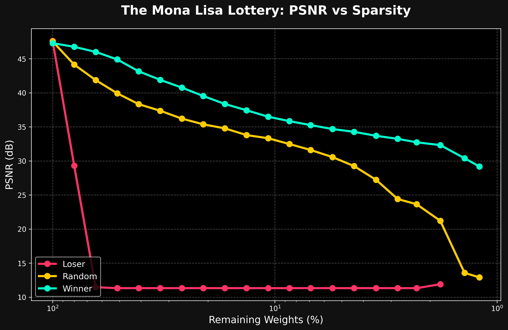
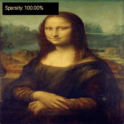

# 🎟️ Losing Tickets in Neural Representations
### *Exploring the Lottery Ticket Hypothesis in Sinusoidal Representation Networks*

> **Abstract:** Implicit Neural Representations (INRs) have revolutionized field-based data storage, yet their over-parameterization remains a challenge for edge deployment. This project investigates the existence of "Winning Tickets"—small, highly-performant sub-networks—within SIREN models. By contrasting them against "Losing Tickets" (highest-magnitude pruning), we demonstrate that SIREN's capacity is tied to a fragile subset of carrier frequencies that, when preserved, allow for **>50x compression** without significant visual degradation.

---

## 🔬 1. Introduction: The Cost of Continuity
Implicit Neural Representations (INRs), like **SIREN (Sitzmann et al., 2020)**, model signals as continuous functions rather than discrete grids. While they offer infinite resolution and easy differentiability, they are often as memory-intensive as the images they represent.

The **Lottery Ticket Hypothesis (Frankle & Carbin, 2018)** suggests that within any randomly initialized dense network, there exists a sub-network (a "winning ticket") that, if trained in isolation from the same initialization, can achieve comparable performance. This project tests if this holds for **Coordinate-MLPs** representing complex textures.

---

## 🛠️ 2. Methodology & Architecture

### 2.1 The SIREN Backbone
We utilize a 5-layer MLP with **256 hidden units** and periodic activation functions:
```math
f(\mathbf{x}) = \sin(\omega_0 \mathbf{W}\mathbf{x} + \mathbf{b})
```
*   **Target Image:** Leonardo da Vinci’s *Mona Lisa* (256 x 256).
*   **Parameters:** ~262,000 floats.
*   **Initialization:** Uniformly sampled from `[-sqrt(6/n), sqrt(6/n)]` with ```math \mathbf{W}``` = 30 for the first layer to capture high-frequency details.

### 2.2 Iterative Magnitude Pruning (IMP)
We follow a strict pruning loop with **Weight Rewinding**:
1.  **Train** to convergence (1000 epochs).
2.  **Prune** 20% of weights based on three competing strategies.
3.  **Rewind** surviving weights to their exact values at `Epoch 0`.
4.  **Repeat** across 20+ iterations until target sparsity (~1%) is achieved.

### 2.3 Experimental Groups
*   **🏆 Winning Ticket (Global Magnitude Pruning):** Prunes the weights with the **lowest** absolute magnitude. These are assumed to be "noise" or redundant parameters.
*   **🎲 Random Ticket (Control):** Prunes weights at random, maintaining the same sparsity level but ignoring magnitude.
*   **📉 Losing Ticket (Anti-Signature Pruning):** Prunes the **highest** magnitude weights. This tests the hypothesis that the largest weights in SIREN act as the "carrier waves" for the image structure.

---

## 📊 3. Results: The Frequency Collapse

The experiment reveals a massive performance gap between the chosen topologies.


*Figure 1: PSNR vs Sparsity curve. The "Winner" ticket remains stable around 30dB even with only 1.8% of weights remaining. The "Loser" ticket collapses instantly to baseline noise (~11dB) at the first pruning step.*

### 🎥 Visualization Dashboard
Below are the animated progressions of each ticket type from **100% → 1% remaining weights**.

| **Ticket Type** | **Visual Progression (GIF)** | **Interpretation** |
| :--- | :--- | :--- |
| **Winner** |  | **Remarkable Resilience.** Even at 1.8% sparsity, the network recovers the facial silhouette and skin tones. |
| **Random** |  | **Logarithmic Decay.** The image gradually blurs into localized color blocks as the network's capacity to represent edges fades. |
| **Loser** |  | **Instant Failure.** Large magnitude weights in SIREN define the periodic activation's magnitude. Removing them makes the network go dark instantly. |

---

## 🛸 4. Discussion: The Space-Time Tradeoff

### 4.1 Theoretical Compression
Our "Winning Ticket" at Iteration 18 (1.8% weights) achieves a **27.8x theoretical compression**.
*   **Dense File Size:** 781 KB
*   **Sparse (COO) Format:** **27 KB**

This proves that SIREN models are heavily over-parameterized and that the "essential" Mona Lisa can be stored in a sub-network smaller than a low-resolution thumbnail.

### 4.2 Why the Loser Fails
In ReLU-based networks, losing tickets often underperform. In SIREN, the "Loser" ticket represents a **catastrophic frequency failure**. Because SIREN relies on the magnitude of sine waves to construct spatial details, removing the largest weights is equivalent to removing the primary oscillators, leaving only sub-harmonics that cannot reconstruct the image.

---

## 🚀 5. Conclusion
This project demonstrates that **Winning Tickets exist within Implicit Neural Representations**. The ability to prune 98%+ of weights while maintaining high fidelity (~30dB) suggests a future where high-resolution field data (NeRFs, SDFs) can be significantly compressed without sacrificing the continuity that makes them valuable.

### ✨ Interactive Exploration
Run the following to see the results locally:
1.  **Dashboard:** Open `outputs/plots/index.html`.
2.  **Benchmark:** View `outputs/space_benchmark.txt`.

---
**References:**
- Sitzmann, V., et al. (2020). *Implicit Neural Representations with Periodic Activation Functions*.
- Frankle, J., & Carbin, M. (2018). *The Lottery Ticket Hypothesis: Finding Sparse, Trainable Neural Networks*.
